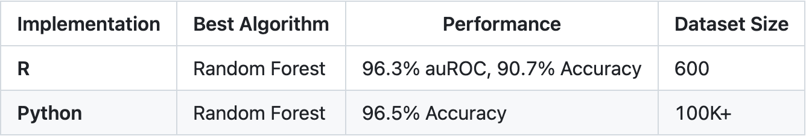
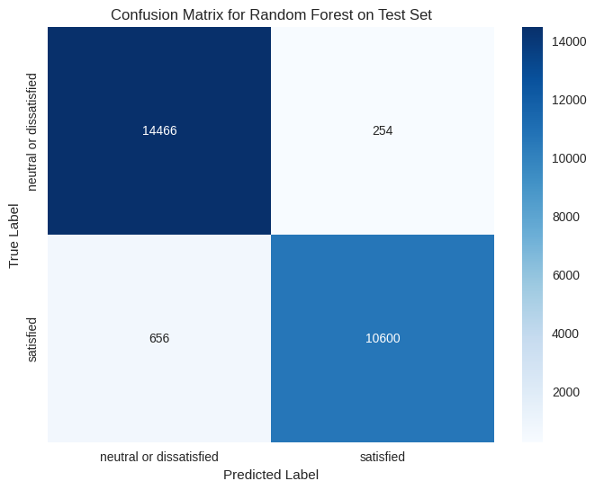
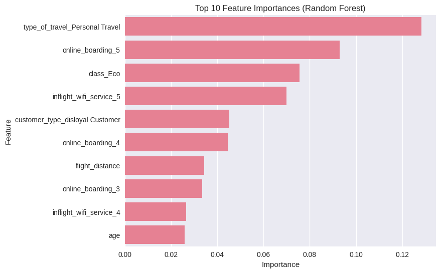

[GitHub Repository](https://github.com/hwong511/airline-satisfaction-prediction-r-and-python){:target="_blank"}

The Goal
============

For this project, I wanted to predict airline passenger satisfaction using machine learning. Originally, I did the whole Python section of the project in Jupyter Notebook. So for the new udpate, I want to build it as a production-ready Python package.

The old notebooks that I used are still available in the `notebooks/` folder of the GitHub repo.

Modeling
============

I implemented KNN, Logistic Regression, and Random Forest to compare different approaches. Random Forest won decisively at 96.5% test accuracy, suggesting complex feature interactions were crucial.

The dataset mixed categorical variables (customer type, class), numeric features (age, distance), and ordinal ratings (service quality). I built custom pipelines for each model to handle these properly and prevent data leakage.

Lastly, since we are training on 100K+ samples, I implemented model and prediction caching, cutting re-run time from minutes to seconds, which would be helpful for rapid iteration.

The model performance is summarized below. Note that for metric selection, I chose auROC in R (for class imbalance) and accuracy in Python (due to class balance).

Feature importance analysis revealed that type of travel, online boarding, class, and inflight wifi were the top predictors of satisfaction.

Takeaways
============

Technical Highlights 
------------

* Random Forest consistently outperforms simpler models
* Larger datasets improve model reliability and stability
* Tailored preprocessing is essential for optimal performance
* Ensemble models effectively capture nonlinear relationships

Business Implications
------------

* In-flight service quality is the primary driver of satisfaction
* Delays significantly impact perceived experience
* Class and loyalty status affect satisfaction ratings
* Predictive models can flag dissatisfied passengers early for intervention